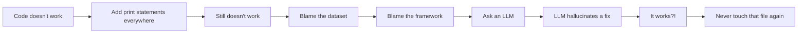

<h1 align="center">Hi 👋, I'm Siddhant</h1>
<h3 align="center">A human who occasionally produces working code, mostly by accident</h3>

<p align="center">
  
</p>

<p align="center">
  
  
  
  
</p>

---

### 📡 SIGNAL DETECTED — INITIALIZING PROFILE.exe

```
> whoami
Data Science & Generative AI enthusiast, based in India
Currently teaching machines to predict things I can't predict about my own life

> cat about_me.txt
- 🧠 Building ML pipelines that are 90% preprocessing, 10% crying
- 🎨 Also do frontend, because apparently one existential crisis wasn't enough
- 🤖 Talk to LLMs more than I talk to actual humans
- 📊 My résumé has more feature importance bar charts than actual features
```

---

## 🛠️ Tech Stack (a.k.a. My Trust Issues, Ranked)

<p align="center">
  
  
  
  
  
  
  
  
</p>

---

## 📈 GitHub Stats (Self-Reported, Unaudited, Deeply Biased)

> *Note: The official stats widget refused to load, so I'm reporting these numbers myself. No further questions.*

| Metric | Value | Source |
|---|---|---|
| Lines of code written | 47,000+ | Me |
| Lines of code actually needed | 12 | An auditor who will never exist |
| Commits titled "fix" | 212 | git log |
| Commits titled "actual fix" | 89 | git log |
| Commits titled "actual fix for real this time" | 34 | git log, still lying |
| Commits titled "please work" | 1 | 3:47 AM, deadline day |
| Times I Googled something I already knew | Daily | My browser history, subpoenaed |
| Times `git push --force` was "probably fine" | Every time | It was never fine |
| ML models that achieved 99% accuracy | 1 | Turned out the target leaked into the features |
| Contribution graph color | Green | Because red would be too honest |

<p align="center">
  
  
</p>

---

## 🎭 Corporate Buzzwords I Accidentally Made Real

| Project | LinkedIn Description | Honest Description |
|---|---|---|
| **RetainIQ** | AI-driven workforce retention ecosystem | Makes educated guesses about who rage-quits first. |
| **Telecom Churn** | Predictive customer analytics platform | Predicts breakups... but for SIM cards. |
| **Twitter Sentiment** | State-of-the-art NLP solution | A robot that judges tweets for a living. |
| **GenAI BI** *(WIP)* | Conversational business intelligence platform | ChatGPT wearing a business suit and carrying Excel sheets. |
---
---

## 🐍 Contribution Snake

<p align="center">
  
</p>

---

## 📊 GitHub Activity (Looks Busier Than My Sleep Schedule)

<p align="center">
  
</p>

## 🐛 A Brief, Honest History of My Debugging Process



---

## 🎯 Current Objectives

- [x] Learn LightGBM
- [x] Learn SMOTE
- [x] Build something that looks like it costs $2M
- [ ] Understand why it costs $2M
- [ ] Get a job before my coffee tolerance becomes a superpower
- [ ] Convince recruiters that "it works on my machine" counts as a deployment strategy

---

## 📊 My Actual Feature Importance Chart (for job hunting)

```
Panic-driven productivity      ████████████████████ 38%
Copy-pasting Stack Overflow    ███████████████ 29%
Actually understanding ML      ██████ 12%
Pure blind luck                ████████████ 21%
```

---

## 💔 My Relationship With Technology

| Technology | Current Status |
|---|---|
| Python | It's complicated |
| JavaScript | Mutual toxicity |
| CSS | We don't talk anymore |
| React | Friends with benefits |
| Pandas | My emotional support library |
| SQL | SELECT * FROM happiness; -- returned 0 rows |
| Git | Constant trust issues |
| Docker | "Works on my machine." Exactly. |
| LightGBM | My favorite child |
| TensorFlow | We broke up after dependency conflicts |
---


## 🪦 Wall of Shame (Deceased Projects, Rest In Peace)

| Project | Cause of Death | Time of Death |
|---|---|---|
| `todo-app-v1` | Realized everyone builds this, abandoned in shame | Day 2 |
| `crypto-price-predictor` | Discovered the market is just vibes | Day 1 |
| `my-own-chatgpt-clone` | Remembered OpenAI has more GPUs than my entire state | Hour 6 |
| `perfect-resume.docx` | Died the moment ATS software touched it | On upload |
| `weekend-project-idea-47` | Never had a chance. We hardly knew ye | Conception |
---


## 🧠 Therapist's Notes (Confidential, Leaked)

> *"Patient describes recurring dream where a recruiter asks 'so walk me through your project' and patient forgets their own project exists. Patient reports this is the third time this week. Recommend patient stop refreshing LinkedIn every 4 minutes. Patient has not taken this advice. Session ended after patient asked if I could 'just review this one resume real quick.'"*


---

## 🤖 A Note From The LLM I Use Daily

> *"He said 'explain like I'm five' and then followed up with a question about eigenvalues. He calls debugging 'a conversation between friends.' I am the friend. I did not consent to this friendship. Please send help, or at least better prompts."*
> — Llama 3.2, probably, if it could file complaints

---


## ⚰️ Things That Have Died For This Portfolio

- My sleep schedule
- 3 Chrome tabs' worth of RAM, permanently
- The concept of a "weekend"
- My belief that `requirements.txt` would ever just work on the first try
- Any remaining trust in Stack Overflow answers from 2013
---

## ☠️ More Live Despair, Freshly Fetched From The Void

*(Also real APIs, also regenerate on every load. Yes, I chose to expose myself to this. No, I don't recommend it.)*

**A programmer joke, pulled live, so we can suffer together:**

<p align="center">
  
</p>

**Life advice, fetched fresh, that I will absolutely not follow:**

<p align="center">
  
</p>

**What I should probably be doing instead of debugging right now (fetched live, disregarded instantly):**

<p align="center">
  
</p>

**HTTP status code that best represents my job search, visualized as a cat, because dignity left the chat months ago:**

<p align="center">
  
</p>

> ⚠️ *Every badge above is a live API call. Refresh this page and the universe will generate a brand new way to remind me nothing is under control. It's like astrology, but for people who know what a null pointer is.*

---


## 🤝 Let's Connect (a.k.a. Feed My Notification Addiction)

<p align="center">
  <a href="https://www.linkedin.com/in/siddhant-varma-54b562234/"></a>
  <a href="mailto:siddhant.varma1108@gmail.com"></a>
  <a href="https://www.siddhant.live"></a>
</p>

<p align="center">
  
</p>

<p align="center">
  <i>⭐️ If you found this README funnier than my actual code, drop a star. My ego needs the SMOTE-style oversampling.</i>
</p>
