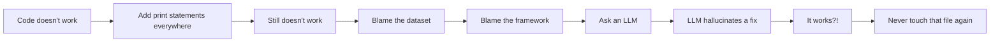

<h1 align="center">Hi 👋, I'm Siddhant</h1>
<h3 align="center">A human who occasionally produces working code, mostly by accident</h3>

<p align="center">
  
</p>

<p align="center">
  
  
  
  
</p>

---

### 📡 SIGNAL DETECTED — INITIALIZING PROFILE.exe

```
> whoami
Data Science & Generative AI enthusiast, based in India
Currently teaching machines to predict things I can't predict about my own life

> cat about_me.txt
- 🧠 Building ML pipelines that are 90% preprocessing, 10% crying
- 🎨 Also do frontend, because apparently one existential crisis wasn't enough
- 🤖 Talk to LLMs more than I talk to actual humans
- 📊 My résumé has more feature importance bar charts than actual features
```

---

## 🛠️ Tech Stack (a.k.a. My Trust Issues, Ranked)

<p align="center">
  
  
  
  
  
  
  
  
</p>

---

## 📈 GitHub Stats (Lies, Damned Lies, and Statistics)

<p align="center">
  
  
</p>

<p align="center">
  
</p>

---

## 🧪 Featured Chaos

| Project | What It Actually Does | What The README Claims |
|---|---|---|
| **RetainIQ** | Predicts if employees will quit, using SMOTE, LightGBM & an LLM copilot | "Enterprise-grade retention intelligence platform" |
| **Random Frontend Site #47** | A luxury real estate site nobody in Dubai will ever see | "Award-worthy immersive digital experience" |
| **MindGuard** (WIP) | Detects burnout via behavioral signals, mostly detects my own | "AI-powered wellness infrastructure" |

---

## 🐛 A Brief, Honest History of My Debugging Process



---

## 🎯 Current Objectives

- [x] Learn LightGBM
- [x] Learn SMOTE
- [x] Build something that looks like it costs $2M
- [ ] Understand why it costs $2M
- [ ] Get a job before my coffee tolerance becomes a superpower
- [ ] Convince recruiters that "it works on my machine" counts as a deployment strategy

---

## 📊 My Actual Feature Importance Chart (for job hunting)

```
Panic-driven productivity      ████████████████████ 38%
Copy-pasting Stack Overflow    ███████████████ 29%
Actually understanding ML      ██████ 12%
Pure blind luck                ████████████ 21%
```

---

## 🤝 Let's Connect (a.k.a. Feed My Notification Addiction)

<p align="center">
  <a href="https://linkedin.com"></a>
  <a href="mailto:you@example.com"></a>
  <a href="#"></a>
</p>

<p align="center">
  
</p>

<p align="center">
  <i>⭐️ If you found this README funnier than my actual code, drop a star. My ego needs the SMOTE-style oversampling.</i>
</p>
